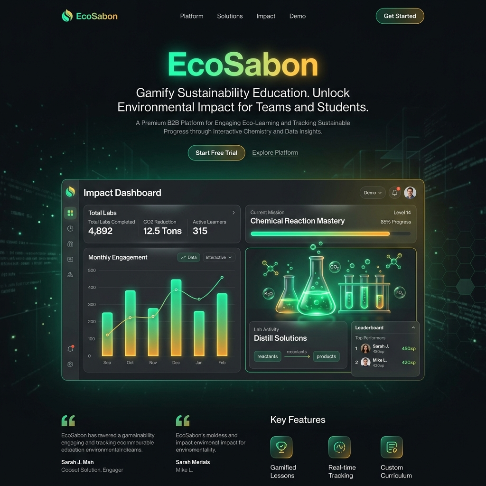
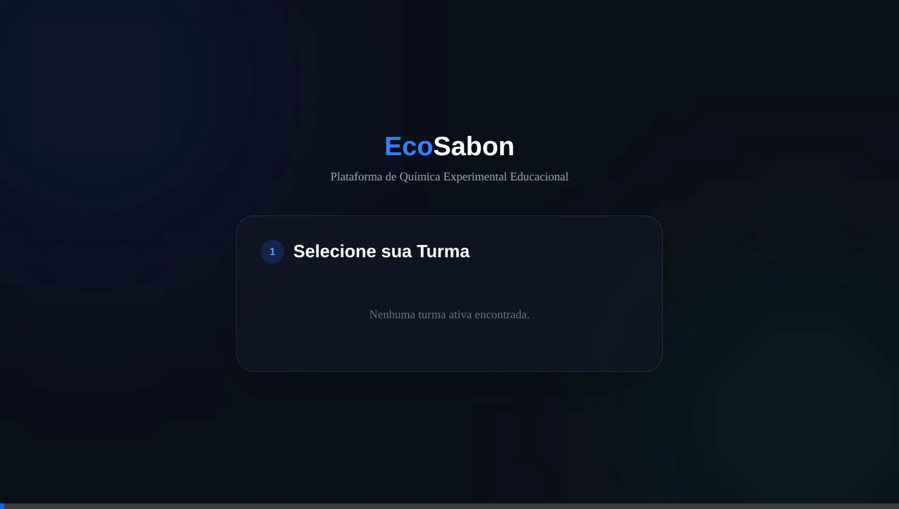
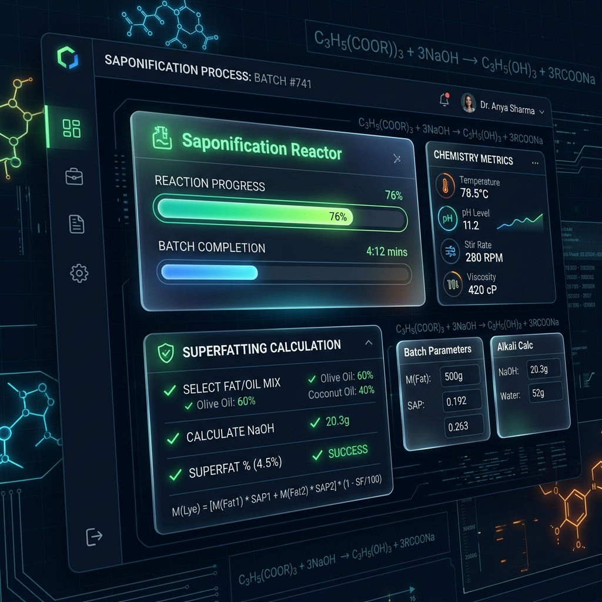
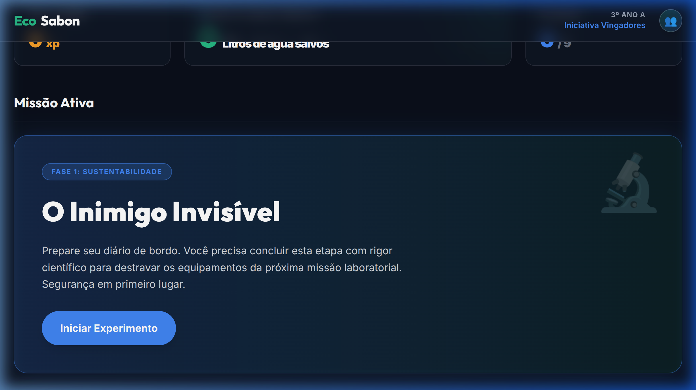

# 🧪 EcoSabon | Plataforma Educacional Gamificada em Química

---

## 📄 Descrição do Projeto

**EcoSabon** é uma plataforma educacional gamificada (SaaS B2B) desenvolvida com a metodologia **Specification-Driven Development (SDD)**. O sistema imerge os estudantes de laboratório ao simular e validar termodinamicamente os passos da técnica *Cold Process* (Saponificação a frio), guiando as "Bancadas" na manipulação matemática de reagentes químicos industriais.

Criada como um estudo intensivo de metodologias arquiteturais maduras (*Monorepo Isomórfico, Clean Architecture e Integração DevOps*), o projeto orquestra restrições severas de Autorização Baseadas em Papéis (RBAC) para garantir máxima governança e segurança na manipulação corporativa das turmas escolares.

---

## 🚀 A Saga de Engenharia (As 5 Fases de Desenvolvimento)

A estruturação tecnológica deste software não foi trivial. Ela foi dividida rigorosamente em marcos, cada um endereçando gargalos técnicos inerentes ao desenvolvimento web escalonável e de Missões interativas.

### 📍 Fase 1: Fundação Estrutural e CRUD Mestre
- **Objetivo:** Estabelecer a anatomia de Bancadas (Alunos), Turmas e Missões.
- **Desafio:** Como garantir que a exclusão de uma Turma inteira não deixasse dezenas de tabelas órfãs de alunos voando no banco de dados e sugando *Memory Leaks* a longo prazo?
- **A Solução Construída:** Implementações avançadas atreladas aos preceitos do `Mongoose` com rotinas *Middlewares de Deletion in Cascade* no Node.js. Qualquer deleção no ecossistema aciona gatilhos que purgam dependentes (fotos, notas e identidades) na base de dados inteira sem intervenção manual do Engenheiro.

### 📍 Fase 2: Muros de Fogo e Validação Estrita de Dados (Onboarding)

- **Objetivo:** Trançar o recebimento de missões formuladas complexas entre o Front e o Back, e isolar a tela de Onboarding.
- **Desafio:** Os alunos submetiam formulários científicos com falhas (valores negativos, strings onde se exigia física de pesos). O Backend precisava rejeitar envios imperfeitos antes sequer de ativar a câmera ou salvar arquivos pesados (`Multer`).
- **A Solução Construída:** Abrasamento de `Zod` Validation Schemas e tipagens `TypeScript` rígidas. Se uma requisição de Missão bater no Firewall do Express faltando 1 único caractere no contrato do Schema, ela ejeta instantaneamente. Erros de sistema baseados em "undefined behavior" chegaram a zero.

### 📍 Fase 3: O Cérebro Matemático (Isomorfismo e Clean Architecture)

- **Objetivo:** Inserir e integrar a química Real do sabão na Plataforma.
- **Desafio Arquitetural Massivo:** As equações químicas de Superfatting e Índice Saponificador eram necessárias *rapidamente* na tela do navegador do aluno (Front-End) para dar avisos visuais imediatos. No entanto, de forma *alguma* o Servidor Node poderia confiar nas contas enviadas pelo usuário (evitando Injeções e Fraudes), devendo re-efetuar tudo sozinho por segurança sem que duplicássemos códigos.
- **A Solução Construída:** Implementação de uma arquitetura central Monorepo com motor `Shared`. Eu desenvolvi a **`SaponificationEngine`** (Motor Termodinâmico Funcional) em uma camada islada e impenetrável. Tanto a Interface React quanto o Pipeline NodeJS consomem e leem extamente do mesmo arquivo (*Single Source of Truth*), tornando-se Isomórficos e acabando com dessincronias matemáticas.

### 📍 Fase 4: O Dossiê Científico e O Cofre Acadêmico (Dashboard)

- **Objetivo:** Emitir o relatório final em PDF unificando todo o trabalho técnico da equipe com suas respectivas fotografias laboratoriais.
- **Desafios:** Renderizar relatórios PDFs unificados pesados do lado do servidor (AWS/DigitalOcean) derreteria o custo do processamento num modelo rápido Institucional. O outro problema central? Impedir uma equipe de conseguir "roubar" as colunas com a nota do relatório das outras bancadas manipulando as URLs abertas do site.
- **A Solução Construída:** 
  1. **"Costless Architecture":** Aplicamos o preceito brutal de repassar as despesas para a máquina do cliente (`Client-Side Rendering`). Programamos uma interface Oculta CSS React interceptada por algoritmos restritos ao `@media print`, delegando para motor de impressão nativo do browser de cada aluno renderizar o PDF final de forma graciosa. Custo para o meu Servidor BackEnd em nuvem? Zero reais. 
  2. **Governança JWT (RBAC):** Os endpoints responsáveis por extrair e desenhar os relatórios operam com *Role-Based Access Control*. O MiddleWare Backend cruza instantaneamente a *"Token-Digital"* da bancada requisitante com a da Missão solicitada e aplica um bloqueio total (`403 Forbidden`) em milionésimos de segundo se a turma tentar ler os Dossiês concorrentes escondida.

### 📍 Fase 5: Privacidade SaaS B2B e Integração DevOps
- **Objetivo:** Pivotar o software para um legítimo ecossistema B2B corporativo fechado às escolas.
- **Desafio:** Quebras acidentais de sintaxe no código vinham sendo empurradas em repositórios limpos. Adicionalmente, permitia-se antes que qualquer usuário anônimo forjasse a criação de Laboratórios inteiros pelo link inicial.
- **A Solução Construída:** O ambiente passou a exigir que apenas Portadores da "Cátedra Mestre" autenticada com Senha do Professor fundem a existência das equipes (Tornando-se um Software Estrito Protegido). Para amarrar o capricho técnico do repositório, erguemos uma infraestrutura rigorosa de Integração CI/CD DevOps em Nuvem (GitHub Actions com Ubuntu Linux): Qualquer novidade de código submetida precisa ser esquadrinhada e compilada passando por Linter Extremo de forma Autônoma e atestando a Qualidade Estática do mesmo antes sequer de chegar até os clientes!

---

## 🛠️ Stack Tecnológica Envolvida

- **Front-End:** React 18, Vite (Fast HMR), Tailwind CSS (Integração Glassmorphism e Print-Ready Nativo), Zustand (Motor de Estado reativo unificando Caching Tokenizável).
- **Back-End:** Express JS Isomórfico, Zod Firewalls, Multer (Local Storage para fotos científicas volumosas).
- **Banco de Dados:** MongoDB Atlas escalável atrelado ao ORM rígido e populado ativamente via Mongoose.
- **Qualidade DevOps:** Typescript Strict, ESLint, GitHub Actions (.yml CI Pipeline), Conteinerização Docker.

---

> 🎯 *Conclusão: Mais do que códigos ou interfaces jogáveis soltas, a plataforma EcoSabon atesta e atende aos mais rigorosos Padrões de Qualidade Sênior focados em performance web e Engenharia limpa (Renderização Oculta WebPrint Zero-Cost, Criptografia de Papéis Isomórfica e CI Cíclicos de Governança).*
