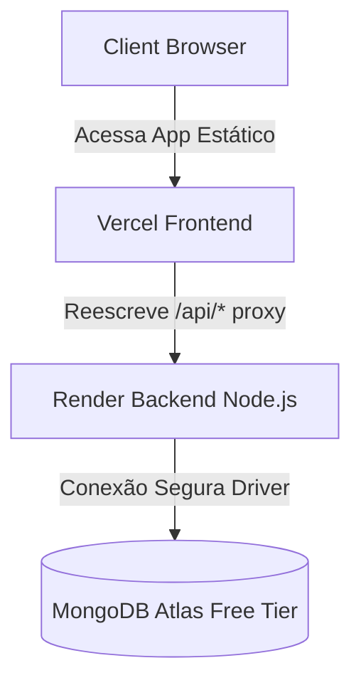

# R129 — Preparação do Deploy Restrito: Plataforma EcoSabon

## 1. Objetivo
Este documento define o plano de preparação operacional, segurança e governança para a futura publicação da Plataforma EcoSabon em ambiente de piloto restrito. O objetivo é estabelecer a arquitetura remota, as políticas de segurança e o mapeamento de variáveis de ambiente sem realizar qualquer criação de serviço ou deploy imediato.

## 2. Estado Consolidado do Sistema
A simulação local em Sandbox (PR #45, R128) homologou as seguintes funcionalidades do piloto restrito:
- **Allowlist Dinâmica**: Cadastro e login de professores restrito aos e-mails configurados na variável de ambiente `PILOT_ALLOWED_TEACHER_EMAILS`.
- **Bloqueio de Intrusos**: Tentativas de onboarding e autenticação fora da allowlist retornam `403 Forbidden`.
- **Controle de Login de Bancadas (Squads)**: Logins de estudantes são bloqueados por padrão em modo piloto e liberados sob controle pela flag `PILOT_ALLOW_SQUAD_LOGIN`.
- **Revogação de Acesso em Tempo de Execução**: Alterações na allowlist de e-mails invalidam tokens ativos em O(1) no middleware de autenticação (`requireAuth`).
- **Comportamento Legado**: Quando `PILOT_MODE=false`, todas as restrições de piloto são ignoradas e a plataforma volta a operar no modo padrão.

## 3. Arquitetura do Ambiente Remoto Futuro
A publicação remota do piloto restrito usará uma infraestrutura desacoplada e segura:

- **Frontend (Vercel)**: Hospedará o cliente estático React + Vite. A comunicação de rede com o backend será feita via proxy transparente configurado no arquivo `vercel.json` (reescrevendo `/api/*` para a URL do backend).
- **Backend (Render)**: Hospedará a API Node.js/Express. O backend será isolado por CORS e rate limiting.
- **Database (MongoDB Atlas)**: Hospedará a base de dados em nuvem. Será utilizado um cluster gratuito (M0 Sandbox) isolado.

## 4. Política de Identidade dos Professores
- **Pessoas Autorizadas**: Apenas os professores Leonardo e Nadja terão permissão de acesso ao piloto.
- **E-mails Reais**: Os e-mails reais de Leonardo e Nadja **nunca** serão escritos no código-fonte, nos commits ou nos arquivos de documentação do repositório.
- **Mecanismo de Injeção**: Os e-mails reais serão configurados unicamente de forma remota no painel do Render, através da variável `PILOT_ALLOWED_TEACHER_EMAILS`.
- **Placeholders de Documentação**: Em relatórios e checklists, utilizaremos os placeholders `<LEONARDO_EMAIL_REAL>` e `<NADJA_EMAIL_REAL>`.

## 5. Política de Dados do Piloto
Para garantir a privacidade e conformidade com a LGPD:
- **Dados Sintéticos**: Nenhuma massa de dados de estudantes ou professores reais será carregada na nuvem.
- **Turmas e Equipes**: O banco do piloto conterá apenas dados de testes sintéticos:
  - Turmas: `3ºA` e `3ºB`
  - Bancadas de até 5 alunos max.
- **Banco de Dados Piloto**: O cluster de banco na nuvem conterá uma base isolada chamada `ecosabon_pilot`.
- **Seed Controlado**: A carga de dados inicial no Atlas será feita exclusivamente usando os scripts `server/seed/restrictedPilotSeed.ts` e o arquivo de dados sintéticos `server/seed/restricted_pilot_data.json`, ativados por comando dedicado executado com autorização.

## 6. Plano MongoDB Atlas (Sem Criar Cluster)
Durante a fase futura de deploy, o provisionamento do banco seguirá estes passos:
1. Criar projeto no MongoDB Atlas dedicado ao piloto da plataforma.
2. Criar um cluster gratuito (M0) em região compatível com o Render (ex: `us-east-1`).
3. Criar usuário de banco com privilégios restritos de escrita e leitura apenas no banco `ecosabon_pilot` (princípio do privilégio mínimo).
4. Gerar senha forte e aleatória para o usuário de banco.
5. Configurar o Network Access (Allowlist de IP):
   - Adicionar IPs do Render ou, no caso do Render Free que usa IPs dinâmicos, configurar provisoriamente `0.0.0.0/0` (com monitoramento rigoroso e senha de banco forte).
6. Montar a Connection String segura com placeholder: `mongodb+srv://<USER>:<PASSWORD>@<CLUSTER>/ecosabon_pilot?retryWrites=true&w=majority`.

**Riscos e Mitigações**:
- *Risco de Exposição da Connection String*: Salva exclusivamente na variável de ambiente `DATABASE_URL` no painel do Render.
- *Risco de Allowlist Ampla (0.0.0.0/0)*: Mitigado pela complexidade da senha do usuário do banco (mínimo 32 caracteres gerados aleatoriamente).

## 7. Plano Render Backend (Sem Criar Serviço)
Durante a fase futura de deploy, a publicação do servidor seguirá estes passos:
1. Conectar o repositório GitHub ao Render e criar um **Web Service**.
2. Definir o diretório raiz como `server/`.
3. Build Command: `npm install`.
4. Start Command: `npm start`.
5. Configurar as variáveis de ambiente necessárias (conforme R130).
6. Configurar as regras de CORS (`ALLOWED_ORIGINS`) aceitando apenas a URL oficial da Vercel.
7. Monitorar a inicialização do container, conferindo logs para confirmar que nenhuma credencial ou JWT foi impresso.
8. Validar a rota `/ping` para assegurar o funcionamento do serviço.

**Riscos e Mitigações**:
- *Spin-down e Cold Starts*: O Render Free desativa serviços após inatividade. O cliente React deve prever um loading state amigável ao aguardar a primeira resposta do servidor.
- *Filesystem Efêmero*: Qualquer upload de foto ou arquivo gerado pelo servidor em disco local será perdido após o reinício do container. A plataforma deve manter uploads de teste limitados e sintéticos.

## 8. Plano Vercel Frontend (Sem Criar Projeto)
Durante a fase futura de deploy, a publicação do cliente React seguirá estes passos:
1. Criar novo projeto na Vercel e apontar para a pasta do repositório.
2. Definir a pasta raiz (`Root Directory`) como `client/`.
3. Framework Preset: `Vite`.
4. Build Command: `tsc -b && vite build`.
5. Output Directory: `dist`.
6. Validar a configuração do arquivo `client/vercel.json` para que as requisições `/api/*` sejam redirecionadas perfeitamente para a URL do Web Service criado no Render.
7. Assegurar que nenhuma variável ou e-mail de allowlist seja configurado no painel da Vercel (mantendo a segurança das credenciais em nível de servidor apenas).

**Riscos e Mitigações**:
- *Redirecionamento Incorreto*: Caso a URL do Render mude, o redirecionamento em `vercel.json` quebrará. Devemos verificar o status do proxy em desenvolvimento antes do deploy definitivo.

## 9. Plano de Rollback e Desligamento
Em caso de comprometimento de segurança, incidente com dados ou encerramento programado do piloto:
1. **Desativação das Variáveis**: Limpar os valores das variáveis de ambiente nos dashboards (inviabilizando logins ativos imediatamente).
2. **Revogação do Banco**: Apagar ou suspender o usuário do banco de dados no MongoDB Atlas e limpar a allowlist de rede.
3. **Desligamento de Serviços**: Pausar ou excluir o Web Service no Render e o projeto na Vercel.
4. **Revogação de Chaves**: Atualizar a variável `JWT_SECRET` forçando o deslogamento automático de todas as sessões.
5. **Relatórios**: Registrar os motivos do desligamento e o estado final limpo no relatório de finalização de piloto.

## 10. Critérios de Sucesso e Abortar

### Critérios de Sucesso do Deploy Futuro
- Backend conectado com sucesso à base `ecosabon_pilot` no Atlas.
- API respondendo `/ping` com status `200 OK` na nuvem.
- Onboarding de Leonardo e Nadja com e-mails reais funcionando sem erros, gerando tokens JWT válidos.
- Bloqueio imediato (`403 Forbidden`) de qualquer outro e-mail.
- Login de bancadas sintéticas bloqueado por padrão (`PILOT_ALLOW_SQUAD_LOGIN=false`).
- Domínio do frontend autorizado exclusivamente no CORS do backend.
- Nenhuma variável de segredo exposta em ferramentas de desenvolvimento do browser.

### Critérios de Abortar (NO-GO no Deploy Futuro)
- Qualquer vazamento de `.env` ou e-mails reais no histórico de commits Git.
- Detecção de segredos em logs públicos do Render.
- CORS configurado de forma insegura (`*`) em ambiente de nuvem.
- Carregamento de dados reais de estudantes.
- Erros de compilação ou regressões de testes (qualquer um dos 238 testes falhando).
- Custos inesperados de infraestrutura (o piloto deve operar exclusivamente na camada gratuita).
