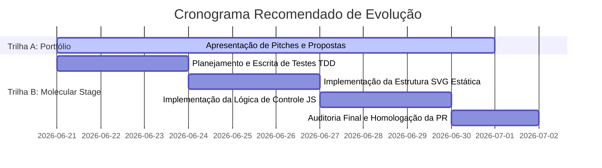

# Estudo Comparativo EcoSabon: HTML/CSS/JS, Articulate PDF, EPUB e Kotobee
## Documento 47: Plano Paralelo de Portfólio e Roadmap do Molecular Stage

**Trilha A:** Portfólio / Comercial  
**Trilha B:** Evolução Técnica Premium Molecular Stage 2.5D/4D  
**Branch de Trabalho:** `docs/ecosabon-parallel-portfolio-and-premium-roadmaps`  
**Autor:** Antigravity (Pair Programming AI)  
**Status:** ✅ CONCLUÍDO (Planejamento paralelo consolidado)  
**Data:** 2026-06-20  

---

### 1. Visão Integrada do Planejamento Paralelo
Com a homologação técnica bem-sucedida da versão **EcoSabon Web-Book Demo v0.1.0** (PR #8), o projeto entra em uma fase de expansão em duas frentes independentes e paralelas:
1. **Frente A (Negócios/Portfólio):** Posicionar o EcoSabon v0.1.0 como um estudo de caso profissional de serviço de desenvolvimento de web-books didáticos portáteis de alta acessibilidade para o mercado educacional.
2. **Frente B (Pesquisa/Tecnologia):** Planejar a evolução futura da visualização molecular qualitativa do e-book (Molecular Stage), mantendo a integridade técnica da versão atual sem adensar o código prematuramente.

---

### 2. Isolamento e Não-Contaminação entre as Trilhas

Para garantir a qualidade e evitar a poluição conceitual e técnica, as trilhas avançam sob rígidos limites de isolamento:

* **Isolamento de Código-Fonte:** A Trilha A (Comercial) não realiza alterações no código-fonte, nos testes ou na folha de estilos do protótipo, atuando exclusivamente em materiais promocionais e relatórios de portfólio.
* **Isolamento Arquitetural:** O planejamento da Trilha B (Molecular Stage) exige que o futuro código seja desenvolvido em um módulo JavaScript separado (`molecular-stage.js`) e com acoplamento nulo sobre os submódulos existentes (`navigation.js`, `hotspots.js`, `scroll.js`, `checklist.js`).
* **Isolamento de Ativos Binários:** Ambas as trilhas respeitam a regra de ignore da pasta `release/`. Nenhum ZIP, PDF ou imagem promocional pesada de portfólio entrará na árvore de commits da branch `main`.

---

### 3. Delimitação de Limites e Escopo

#### **Limites da Trilha A (Portfólio/Comercial):**
* As propostas comerciais de pacotes e preços são apenas **hipóteses comerciais estimativas** e não preços fixos obrigatórios.
* É proibido o uso comercial ou promocional de marcas de instituições ou depoimentos de clientes sem autorização formal por escrito.
* Nenhuma promessa de validação de aprendizagem acadêmica ou resultados científicos finais pode ser incluída nos materiais promocionais sem o suporte de estudos controlados e comitês de ética aprovados.

#### **Limites da Trilha B (Evolução Molecular Stage):**
* Fica proibida a implementação de simuladores numéricos dinâmicos de estequiometria (C4/3E).
* Fica proibido o uso de WebGL, Three.js, Canvas 3D rotativo ou Unity. A visualização molecular deve basear-se em SVGs vetoriais 2.5D estáticos com animação temporal de quadros linearizados acionados via CSS/JS nativos.
* Nenhuma persistência local, rede ou telemetria é autorizada para o módulo.

---

### 4. Riscos de Mistura entre Comercial e Técnico
* **Risco de Falsa Validação:** Utilizar o case do EcoSabon no portfólio comercial sugerindo que o material foi validado cientificamente por pesquisas acadêmicas sem declarar que os dados atuais de homologação são fictícios.
  * *Mitigação:* Todos os materiais comerciais devem explicitar a natureza de protótipo de homologação do material e que dados reais dependem do desenho de pesquisa do pesquisador acadêmico.
* **Risco de Promessa de Renderização 3D Complexa:** Atrair clientes prometendo animações moleculares 3D interativas em tempo real baseadas no termo "Molecular Stage" sem esclarecer as limitações técnicas e pedagógicas do design estático do SVG.
  * *Mitigação:* O briefing de pré-venda deve detalhar as vantagens da renderização SVG (peso ultraleve, acessibilidade por leitores de tela e impressão perfeita) frente a motores 3D Canvas convencionais inacessíveis.

---

### 5. Cronograma e Ordem Recomendada de Evolução

---

### 6. Recomendação Final de Governança

> [!IMPORTANT]
> * **Ação Imediata para Trilha A:** Aprovada a utilização da documentação da Trilha A para composição de materiais promocionais e propostas comerciais externas.
> * **Ação Imediata para Trilha B:** A trilha permanece **exclusivamente em fase de planejamento**. Fica proibida qualquer escrita de código de renderização molecular no diretório `ebook-ecosabon-prototipo/` até nova autorização explícita.
