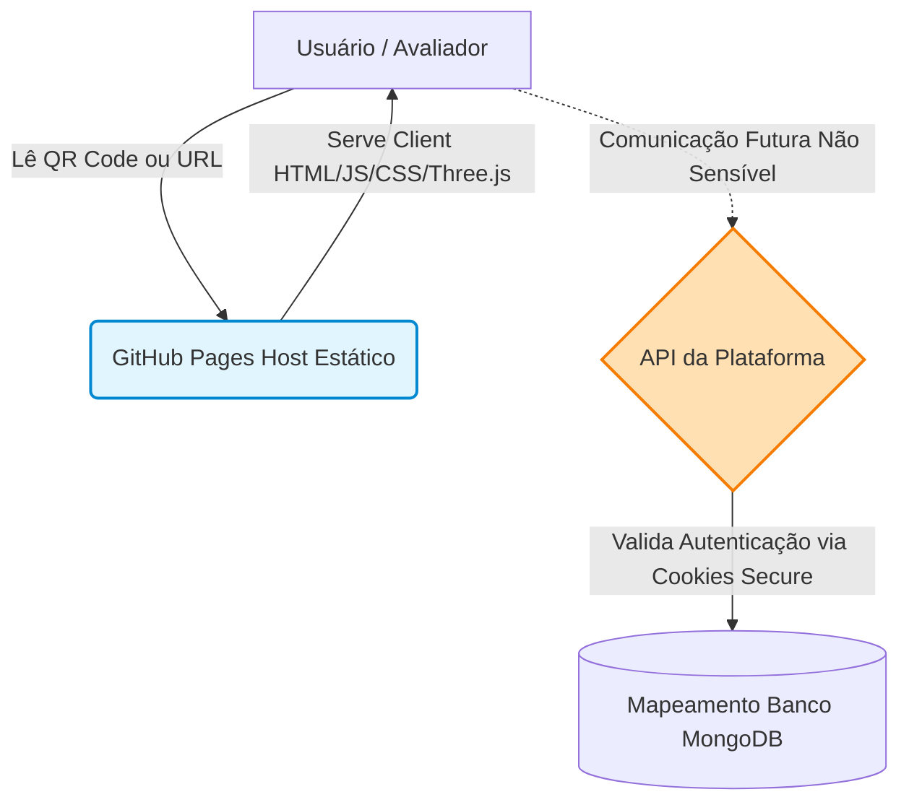

# Relatório 88 — Plano de Ação: Deploy no GitHub Pages & Cybersecurity Gates (EcoSabon)

**Fase:** WBC-P2 — Deploy GitHub Pages + QR Code + Auditoria de Cibersegurança em Modo Estrito  
**Branch:** `docs/ecosabon-deploy-pages-cybersecurity-plan`  
**Base:** `main`  
**Status:** Planejamento e Auditoria Preparatória (Sem Alteração de Código / Sem Deploy / Sem Commits na `main`)  
**Data:** 2026-06-26  

---

## 1. Objetivo

Este plano de ação revisado estabelece diretrizes rigorosas, seguras e profissionais para o futuro deploy do web-book interativo **EcoSabon** no GitHub Pages, planejamento para emissão e governança do respectivo QR Code para a dissertação, e auditoria prévia de cibersegurança em toda a Plataforma EcoSabon (incluindo backend e web-book).

O objetivo principal é garantir que a disponibilização do web-book como vitrine de marketing respeite as restrições da arquitetura estática, estabelecendo portões (gates) de cibersegurança claros e testáveis antes de qualquer deploy real.

---

## 2. Contexto

O web-book Premium 3D funciona como o produto-vitrine e a porta de entrada da Plataforma Educacional Sabão. Para que seja disponibilizado a avaliadores acadêmicos (via QR Code em dissertação) e público externo, a hospedagem estática no GitHub Pages se apresenta como uma alternativa de baixo custo operacional e alta disponibilidade.

No entanto, por se tratar de um ambiente estático público, os seguintes fatores exigem atenção imediata antes de qualquer publicação:
* O código compilado e os recursos são expostos na íntegra a qualquer visitante.
* O GitHub Pages não executa lógica server-side protegida e não permite cabeçalhos HTTP customizados por padrão.
* Variáveis de ambiente no build do front-end são incorporadas de forma estática no bundle compilado.
* É necessário garantir que nenhuma credencial ou lógica privada seja exposta no processo.

---

## 3. Correções Necessárias no Plano Anterior

Em conformidade com as boas práticas de cibersegurança em sistemas distribuídos e as diretrizes do Modo Estrito, o plano anterior é reformulado para eliminar premissas errôneas de "segurança por ocultação" do lado cliente. 

As seguintes correções de linguagem e de conceito são aplicadas formalmente:

* **Declaração de Inspecionabilidade:**
  > [!IMPORTANT]
  > Código front-end, incluindo JS/TS/TSX compilado, é inerentemente inspecionável no navegador. A segurança deve depender de ausência de segredos no front-end, validação no backend, autenticação segura, CORS/CSP adequados, cookies seguros e não de ocultação do código cliente.

* **Revisão Vocabular:**
  * Em vez de *"garantir segurança absoluta"*, utiliza-se **"reduzir superfície de risco"**.
  * Em vez de *"proteger TSX contra exposição"* ou *"esconder código do front-end"*, utiliza-se **"verificar ausência de segredos no front-end"** e **"impedir exposição de chaves privadas"**.
  * Em vez de *"link permanente garantido"*, utiliza-se **"pública e estável enquanto mantida"**.
  * Em vez de *"deploy seguro por si só"*, utiliza-se **"validar controles verificáveis antes do deploy"**.
  * Em vez de *"ocultar variáveis sensíveis"*, utiliza-se **"não incluir variáveis sensíveis em prefixes públicos"** e **"não persistir tokens/dados pessoais no navegador"**.

---

## 4. Arquitetura de Deploy GitHub Pages

O deploy no GitHub Pages servirá exclusivamente para a distribuição pública dos arquivos estáticos do web-book (vitrine). A separação de responsabilidades é definida da seguinte forma:



* **Vitrine Estática (GitHub Pages):** Hospeda os arquivos compilados do e-book sob o repositório público `plataforma_educacional_sabao`. Não manipula dados confidenciais dos alunos, logs de notas ou chaves privadas do servidor.
* **Plataforma Dinâmica (Servidor Dedicado):** O backend real da Plataforma (Node/Express em [server/server.ts](file:///home/leonardomaximinobernardo/My_projects/plataforma_educacional_sabao/server/server.ts)) processa autorização RBAC, persistência MongoDB e controle de bancadas.

---

## 5. Estratégia de Build

Para manter o caráter portátil do web-book interativo (capaz de rodar localmente offline abrindo o `index.html` diretamente do disco, bem como servido a partir de um subdiretório do GitHub Pages), a estratégia de build é dividida em dois alvos:

### A. Build Offline/Local (Portável)
Mantém o comportamento atual definido no [ebook-ecosabon-prototipo/vite.config.js](file:///home/leonardomaximinobernardo/My_projects/plataforma_educacional_sabao/ebook-ecosabon-prototipo/vite.config.js):
* **Configuração:** `base: './'`
* **Objetivo:** Gerar um build onde todos os caminhos de assets sejam relativos. Isso possibilita compactar a pasta `dist` em um arquivo `.zip` e distribuí-la para rodar em computadores sem conexão com a internet ou a partir de mídias locais.

### B. Build para GitHub Pages (Web Vitrine)
Gera o bundle preparado para ser hospedado sob o caminho da URL do repositório no GitHub Pages (`https://<username>.github.io/plataforma_educacional_sabao/`):
* **Configuração:** `base: '/plataforma_educacional_sabao/'`
* **Objetivo:** Garantir a correta resolução de caminhos absolutos do servidor web para assets estáticos e scripts Vite.

---

## 6. Governança do Branch `gh-pages`

Para evitar poluição do histórico de commits da branch `main` e vazamentos acidentais de builds antigos:

1. **Diretório Ignorado na `main`:** O diretório compilado `ebook-ecosabon-prototipo/dist/` deve permanecer estritamente listado no [.gitignore](file:///home/leonardomaximinobernardo/My_projects/plataforma_educacional_sabao/.gitignore) da `main`.
2. **Branch Isolada `gh-pages`:** O deploy deve ser feito publicando exclusivamente os arquivos gerados dentro de `dist` na raiz de uma branch órfã dedicada chamada `gh-pages`.
3. **Desativação do Jekyll:** A publicação estática no GitHub Pages deve conter o arquivo `.nojekyll` na raiz da branch `gh-pages`, instruindo o servidor do GitHub a não processar os arquivos com o motor Jekyll (preservando pastas que comecem com underline, como as pastas de assets do Vite).

---

## 7. QR Code: Regras de Emissão e Distribuição

A geração do QR Code deve seguir um protocolo estrito para evitar inconsistências e apontamentos para caminhos quebrados:

* **Momento da Emissão:** O QR Code definitivo só poderá ser gerado **após** o deploy ter sido concluído, a URL do GitHub Pages estar pública, ativa e sua navegação testada/validada manualmente do lado cliente.
* **Destino do Arquivo:** O arquivo PNG gerado deve ser armazenado localmente em:
  `local_release/qrcode_ecosabon_github_pages.png`
* **Diretiva de Controle:** O QR Code **não deve** ser versionado no histórico da branch principal `main`. Ele deve ser tratado como um artefato local ou anexado diretamente como um asset de release do repositório Git, evitando poluição de mídia binária mutável na base de código.
* **Linguagem de Distribuição:** A URL e o QR Code devem ser apresentados como caminhos *"públicos e estáveis enquanto o repositório for mantido pelo autor"*, abstendo-se de termos como *"link permanente garantido"*.

---

## 8. Diretrizes de Auditoria de Cibersegurança

A auditoria deve validar os seguintes pontos críticos de cibersegurança em todo o reposistema EcoSabon antes do deploy:

* **Front-end / Web-book:**
  * Ausência total de chamadas HTTP de escrita, `fetch`, `XMLHttpRequest`, ou `WebSocket` não autorizadas.
  * O e-book deve comportar-se estritamente como uma aplicação de leitura interativa qualitativa.
  * Zero persistência de dados sensíveis ou chaves de acesso no navegador.

* **Variáveis de Ambiente:**
  * Certificar que variáveis compiladas via prefixo público (ex: `VITE_`, `REACT_APP_`, `NEXT_PUBLIC_`) não contenham senhas, secrets de bancos de dados ou chaves criptográficas privadas.

* **Plataforma / Backend:**
  * Validação de que o [.gitignore](file:///home/leonardomaximinobernardo/My_projects/plataforma_educacional_sabao/.gitignore) exclui arquivos `.env` de produção.
  * O arquivo [server/.env.example](file:///home/leonardomaximinobernardo/My_projects/plataforma_educacional_sabao/server/.env.example) não deve conter secrets de produção reais.
  * O middleware de autenticação [server/middleware/auth.ts](file:///home/leonardomaximinobernardo/My_projects/plataforma_educacional_sabao/server/middleware/auth.ts) não deve possuir fallbacks vulneráveis para chaves secretas (deve falhar imediatamente se a variável de ambiente correspondente for nula).
  * CORS configurado por allowlist restrita em produção, sem wildcards (`*`) permissivos.
  * Logs do servidor protegidos contra vazamento de informações de autenticação (JWT) ou senhas.
  * Validação estrita de arquivos no middleware de upload ([server/middleware/upload.ts](file:///home/leonardomaximinobernardo/My_projects/plataforma_educacional_sabao/server/middleware/upload.ts)): limitação de 5MB e filtro MIME-type rígido para evitar RCE (Remote Code Execution) por injeção de scripts maliciosos.

---

## 9. Comandos de Verificação e Auditoria

Os seguintes scripts de auditoria automatizados são previstos para execução na etapa de auditoria pré-deploy:

### 1. Auditoria de Segredos e Variáveis Públicas no Repositório
Busca chaves, senhas ou variáveis públicas do front-end que possam conter chaves sensíveis expostas de maneira indevida.
```bash
grep -R "NEXT_PUBLIC_\|VITE_\|REACT_APP_\|API_KEY\|SECRET\|TOKEN\|PRIVATE_KEY\|PASSWORD" . --exclude-dir=node_modules --exclude-dir=dist --exclude-dir=.git || true
```

### 2. Auditoria de Arquivos de Ambiente (`.env`) Rastreados
Garante que nenhum arquivo `.env` contendo dados sensíveis reais de desenvolvimento ou produção tenha sido adicionado acidentalmente ao Git.
```bash
git ls-files | grep -E "(^|/)\.env$|\.env\." || true
```
*(Nota: O arquivo `server/.env.example` é esperado neste resultado por não conter segredos reais).*

### 3. Auditoria de Uso de Storage no Front-end
Verifica a presença de armazenamento local no navegador para assegurar que tokens de autenticação ou dados pessoais sensíveis não estejam sendo persistidos.
```bash
grep -R "localStorage\|sessionStorage" ebook-ecosabon-prototipo client curso-interativo --include="*.js" --include="*.ts" --include="*.tsx" --include="*.html" || true
```
* **Regra de Aceite:**
  * Uso de `localStorage` para tokens ou dados confidenciais é proibido.
  * Se `sessionStorage` for utilizado para estado não sensível de interface, deve ser documentado e limpo no encerramento da aba.
  * Preferências estritamente não sensíveis (ex: modo escuro) no `localStorage` devem ser justificadas.

### 4. Auditoria de Conectividade Externa no Web-book Vitrine
Assegura que o web-book está funcionando em modo autônomo offline, sem efetuar requisições indevidas de rede.
```bash
grep -R "fetch\|XMLHttpRequest\|WebSocket\|EventSource" ebook-ecosabon-prototipo --include="*.js" --include="*.html" || true
```
* **Regra de Aceite:** O resultado esperado deve ser preferencialmente vazio. Qualquer chamada existente de rede deve ser auditada e catalogada como limitação técnica aceita.

### 5. Auditoria de Configuração de CORS no Servidor
Verifica a existência de allowlist explícita na configuração do servidor e ausência de wildcards em ambiente produtivo.
```bash
grep -R "ALLOWED_ORIGINS\|cors" server --include="*.ts"
```

### 6. Auditoria de Fallbacks Vulneráveis no JWT
Garante que o backend rejeite a inicialização caso o `JWT_SECRET` não seja fornecido, sem tolerar fallbacks de desenvolvimento ou chaves padrões vulneráveis do tipo "master key".
```bash
grep -R "ecosabon_master_key\|JWT_SECRET ||" server shared client --include="*.ts" --include="*.tsx" || true
```

### 7. Auditoria de Parâmetros de Cookies e Sessão
Se aplicável, verifica as propriedades de segurança aplicadas a cookies criados pelo backend.
```bash
grep -R "httpOnly\|sameSite\|secure\|cookie" server --include="*.ts" || true
```
* **Regra de Aceite:** Cookies de autenticação devem, obrigatoriamente, conter as flags `HttpOnly`, `Secure` e `SameSite=Strict/Lax`.

### 8. Auditoria de Diretivas CSP (Content Security Policy)
Mapeia a política de segurança de conteúdo implementada no servidor e planeja a meta CSP utilizável no front-end estático do GitHub Pages.
```bash
grep -R "Content-Security-Policy\|default-src\|script-src\|connect-src" . --exclude-dir=node_modules --exclude-dir=dist || true
```

### 9. Auditoria de Dependências Vulneráveis
Roda varredura de segurança contra vulnerabilidades conhecidas em dependências do projeto.
```bash
npm audit --omit=dev
npm audit --prefix ebook-ecosabon-prototipo --omit=dev
cd server && npm audit --omit=dev && cd -
```

---

## 10. Regras de Bloqueio (Gates de Aceite)

Qualquer uma das seguintes ocorrências será classificada como **Condição de Bloqueio Definitivo** para o deploy do web-book e homologação da plataforma:

| Condição de Bloqueio | Racional Técnico |
|---|---|
| **Segredo real exposto no código** | Credenciais ou senhas em arquivos estáticos ou arquivos versionados. |
| **Arquivo `.env` real rastreado** | Inclusão de `.env` sob versionamento do repositório Git. |
| **Chave privada em variáveis públicas** | Prefixos `VITE_` ou similares no front-end contendo dados criptográficos privados. |
| **Tokens ou dados pessoais em `localStorage`**| Armazenamento inadequado de sessão ou informações de usuários/estudantes no client-side. |
| **Chamadas externas inexplicadas no web-book** | Requisições a endpoints não documentados ou que comprometam o comportamento offline. |
| **Wildcard CORS (`*`) em Produção** | Exposição da API a requisições de origens não autorizadas. |
| **Fallback em `JWT_SECRET`** | Aceitação de chave secreta de autenticação fraca ou padronizada no código do servidor. |
| **Source Maps ativos em produção** | Publicação de arquivos `.map` que facilitem a engenharia reversa excessiva de lógicas internas do cliente (se houver dados comerciais críticos). |
| **Diretório `dist/` rastreado na `main`** | Violação da governança de branch de deploy. |
| **QR Code apontando para URL não validada** | Emissão de código para links offline ou links incorretos que levem a erro 404. |
| **Deploy com PRs pendentes na vitrine** | Falta de consolidação do código do e-book antes do build. |
| **Uso de linguagem inadequada** | Publicação do web-book com termos de "produto final validado" em vez de protótipo acadêmico qualitativo. |

---

## 11. Limitações Honestas do GitHub Pages

O plano futuro deve considerar e documentar de forma clara as limitações inerentes da infraestrutura do GitHub Pages:

1. **Hospedagem Estática Exclusiva:** O GitHub Pages serve apenas arquivos estáticos (HTML, JS, CSS, mídias). Ele **não executa lógica dinâmica ou código backend**.
2. **Exposição Inerente:** Qualquer segredo, token, segredo de API ou chave criptográfica incluído no código front-end (mesmo em variáveis com prefixo `VITE_`) será exposto ao navegador do usuário no momento do download do bundle.
3. **Ausência de Cabeçalhos HTTP Customizados:** O GitHub Pages não suporta a injeção de cabeçalhos de segurança dinâmicos, tais como headers HTTP de `Content-Security-Policy` (CSP) customizados ou cookies com a flag `HttpOnly`. 
4. **Dependência de Meta Tags CSP:** A aplicação de políticas CSP no GitHub Pages é restrita à tag `<meta http-equiv="Content-Security-Policy" content="...">` no `index.html`. Meta tags CSP possuem limitações em comparação com cabeçalhos HTTP reais (por exemplo, não suportam diretivas como `frame-ancestors` ou relatórios de violação).

---

## 12. Checklist de Execução Futura

Uma vez que a execução das tarefas de deploy e geração de QR Code for formalmente autorizada pelo usuário, o operador técnico deverá seguir os seguintes passos sequenciais:

- [ ] **Etapa 1:** Verificar se a branch `main` está atualizada e limpa (`git status`).
- [ ] **Etapa 2:** Confirmar se todos os PRs de conteúdo do e-book foram mergeados.
- [ ] **Etapa 3:** Executar a suite completa de testes em todas as workspaces:
  * No e-book: `npm test --prefix ebook-ecosabon-prototipo`
  * No cliente da plataforma: `npm test`
  * No servidor: `cd server && npx vitest run`
- [ ] **Etapa 4:** Executar todos os comandos de auditoria de cibersegurança (Seção 9).
- [ ] **Etapa 5:** Resolver e mitigar quaisquer achados de segurança classificados como bloqueantes.
- [ ] **Etapa 6:** Executar o build específico para GitHub Pages com o caminho correto do repositório:
  ```bash
  npm run build --prefix ebook-ecosabon-prototipo -- --base=/plataforma_educacional_sabao/
  ```
- [ ] **Etapa 7:** Testar localmente a integridade da pasta gerada (`dist`) utilizando um servidor HTTP local estático (ex: `npx vite preview`).
- [ ] **Etapa 8:** Criar ou atualizar a branch isolada `gh-pages` a partir do conteúdo de `ebook-ecosabon-prototipo/dist/`.
- [ ] **Etapa 9:** Incluir o arquivo `.nojekyll` na raiz da branch `gh-pages`.
- [ ] **Etapa 10:** Efetuar o push da branch `gh-pages` para o repositório remoto.
- [ ] **Etapa 11:** Ativar e configurar manualmente a fonte do GitHub Pages nas configurações do repositório no GitHub para ler a partir da branch `gh-pages`.
- [ ] **Etapa 12:** Aguardar o deploy automático do GitHub Actions e testar a URL pública gerada no navegador de forma minuciosa.
- [ ] **Etapa 13:** Apenas com a URL pública validada, utilizar gerador de QR Code local para salvar o arquivo de imagem em `local_release/qrcode_ecosabon_github_pages.png`.
- [ ] **Etapa 14:** Adicionar a imagem do QR Code gerado aos releases do repositório no GitHub (não versionar na `main`).
- [ ] **Etapa 15:** Elaborar e registrar o Relatório de Deploy Final contendo: URL pública, hash do commit da `main` implantado, data de execução e sumário de conformidade de segurança.

---

## 13. Decisão Final

DECISÃO: O DEPLOY NO GITHUB PAGES É VIÁVEL, MAS SÓ DEVE SER EXECUTADO APÓS AUDITORIA DE CIBERSEGURANÇA, BUILD PAGES COM BASE CORRETA, PRESERVAÇÃO DO BUILD OFFLINE, VALIDAÇÃO LOCAL DO DIST, PUBLICAÇÃO ISOLADA NO BRANCH GH-PAGES E GERAÇÃO DE QR CODE APÓS URL PÚBLICA VALIDADA.
