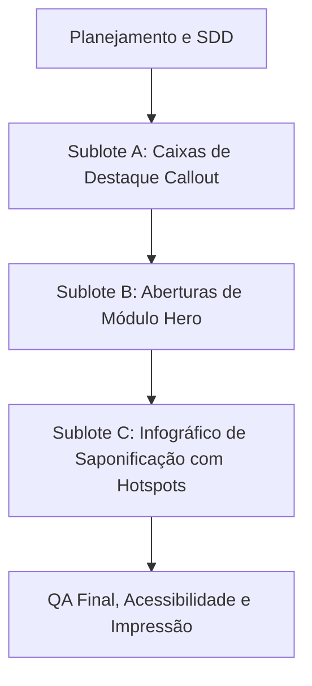

# Estudo Comparativo EcoSabon: HTML/CSS/JS, Articulate PDF, EPUB e Kotobee
## Documento 05: Plano de Adaptação EcoSabon

Este documento apresenta uma proposta de planejamento para evoluções futuras no web-book EcoSabon (Execução 3B ou Execução 4), com foco na incorporação controlada de melhorias visuais e interativas inspiradas no benchmark do Kotobee.

---

### 1. Fases e Sublotes de Adaptação Propostos (Não Executar nesta etapa!)

Para garantir a governança e evitar regressões técnicas, a implementação deve ser fracionada em 3 sublotes complementares, obedecendo ao rigor metodológico do projeto.

#### **Sublote A: Destaques Didáticos (Callouts) - Melhoria Visual Segura**
* **Objetivo:** Adicionar caixas estilizadas para diferenciar visualmente dicas de mediação pedagógica, alertas de segurança e erros comuns nas estações.
* **Tarefas:**
  1. Definir classes BEM no `main.css` (`.callout`, `.callout--info`, `.callout--safety`).
  2. Substituir as marcações de parágrafo simples em `index.html` correspondentes aos blocos de reveal nas estações.
  3. Validar se o contraste visual das fontes sobre os novos fundos das caixas respeita as diretrizes de acessibilidade (mínimo de 4.5:1).

#### **Sublote B: Aberturas de Módulo Hero (Editorial) - Melhoria Visual Segura**
* **Objetivo:** Enriquecer a transição entre módulos no fluxo de leitura contínua com banners marcantes e gradientes adaptados.
* **Tarefas:**
  1. Implementar a classe `.module-hero` no CSS.
  2. Atualizar o `index.html` envelopando os títulos dos três módulos existentes nestes novos banners.
  3. Garantir que, na impressão, os banners de módulo sejam convertidos em cabeçalhos lineares simples em preto e branco para economizar tinta.

#### **Sublote C: Infográfico Reativo com Hotspots (Interativo) - Melhoria Avançada**
* **Objetivo:** Transformar as moléculas estáticas do infográfico de saponificação em elementos com hotspots interativos acessíveis por teclado, exibindo definições químicas locais (Triglicerídeo, NaOH, Sabão, Glicerol) ao clique.
* **Tarefas:**
  1. Desenvolver as funções `initInfographicHotspots()` e `toggleHotspotBubble()` em `interactions.js`.
  2. Inserir tags `<button>` com `aria-expanded` e `aria-controls` no contêiner do infográfico em `index.html`.
  3. Adicionar testes unitários no Vitest para assegurar que cliques e navegação por teclado (Enter/Space) nos botões de hotspot alternem corretamente os balões informativos.

---

### 2. Preservação de Testes e Gates de Governança

* **Test-Driven Development (TDD):** Nenhuma alteração nos arquivos HTML ou JavaScript de produção de qualquer sublote pode ser commitada sem que testes unitários e de fumaça correspondentes sejam adicionados à suíte Vitest em `tests/interactions.test.js`.
* **Preservação de Testes Anteriores:** Os 50 testes existentes na `main` devem continuar passando sem qualquer alteração nas expectativas de teste originais.
* **Placeholders Acadêmicos:** A contagem de termos marcadores em `index.html` deve permanecer inalterada:
  * `"DADOS FICTÍCIOS FOR TEST"`: **2** ocorrências.
  * `"habilidade BNCC"`: **1** ocorrência.
* **Simulador IoT (C4/3E):** Permanece estritamente **bloqueado**. Qualquer slider ou cálculo dinâmico de simulação experimental está vetado, mantendo a neutralidade do e-book como roteiro didático de orientação e evitando conflitos com comitês de ética em pesquisa acadêmica.
