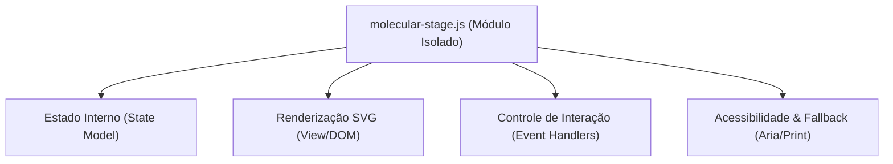

# Trilha Evolução Premium Molecular Stage 2.5D/4D
## Documento 02: Especificação de Clean Architecture e Acoplamento

Este documento descreve a organização arquitetural proposta para a futura implementação da camada **Molecular Stage** sob os princípios de Clean Architecture e acoplamento fraco.

---

### 1. Diretriz de Isolamento Arquitetural (Sem Contaminação)
Para preservar a estabilidade da versão atual `ecosabon-demo-v0.1.0`, o novo módulo deve residir em um arquivo de script isolado e auto-suficiente:
* **Caminho do Script Futuro:** `ebook-ecosabon-prototipo/src/scripts/molecular-stage.js`
* **Não Contaminar Outros Componentes:**
  * O novo arquivo de script não deve injetar lógica ou modificar as funções internas de `navigation.js`, `hotspots.js`, `scroll.js` ou `checklist.js`.
  * A integração no script inicializador central `app.js` deve ser feita de forma estritamente isolada no bootstrap de inicialização do módulo, sem expor estados do Molecular Stage de forma global.

---

### 2. Separação de Responsabilidades (Camadas do Módulo)

O arquivo `molecular-stage.js` será organizado internamente em 4 camadas bem delimitadas:



#### **1. Estado Interno (State Model):**
Gerencia o progresso das etapas da reação (índice do estado ativo, de 0 a 2). Exemplo de estrutura:
```javascript
const state = {
  currentStep: 0,
  maxSteps: 2,
  stepsData: [
    { title: "Etapa 1: Reagentes", desc: "Estrutura do triacilglicerol e NaOH..." },
    { title: "Etapa 2: Transição", desc: "Ataque nucleofílico à carbonila..." },
    { title: "Etapa 3: Produtos", desc: "Sabão e Glicerina formados..." }
  ]
};
```

#### **2. Renderização SVG (View/DOM):**
Responsável por atualizar as classes de animação e estados visuais no contêiner SVG. Manipula apenas atributos como `opacity`, `transform` e classes CSS estruturadas (ex: `.molecular-stage__atom--active`).

#### **3. Controle de Interação (Event Handlers):**
Registra e gerencia os cliques de botões avançar/voltar e atalhos de teclado (setas esquerda/direita), atualizando o modelo de estado e disparando a renderização visual correspondente.

#### **4. Acessibilidade & Fallback (Aria/Print):**
Gerencia a injeção de textos descritivos em regiões `aria-live="polite"` e garante que, sob a folha de estilos de impressão, todos os 3 estados visuais de reação apareçam simultaneamente desenhados lado a lado, ocultando botões de interação interativa.

---

### 3. API Pública do Módulo

O módulo exportará uma interface minimalista para inicialização externa segura:

```javascript
/**
 * Inicializa a funcionalidade do Molecular Stage.
 * @param {HTMLElement} container - O elemento container DOM onde o SVG está renderizado.
 * @returns {boolean} - Retorna true se a inicialização ocorreu com sucesso.
 */
export function initMolecularStage(container) {
  if (!container) return false;
  // Registrar eventos, validar acessibilidade e configurar estado
  return true;
}
```
Isso garante acoplamento nulo. A inicialização em `app.js` consistirá apenas em verificar a existência do contêiner e disparar `initMolecularStage`.
